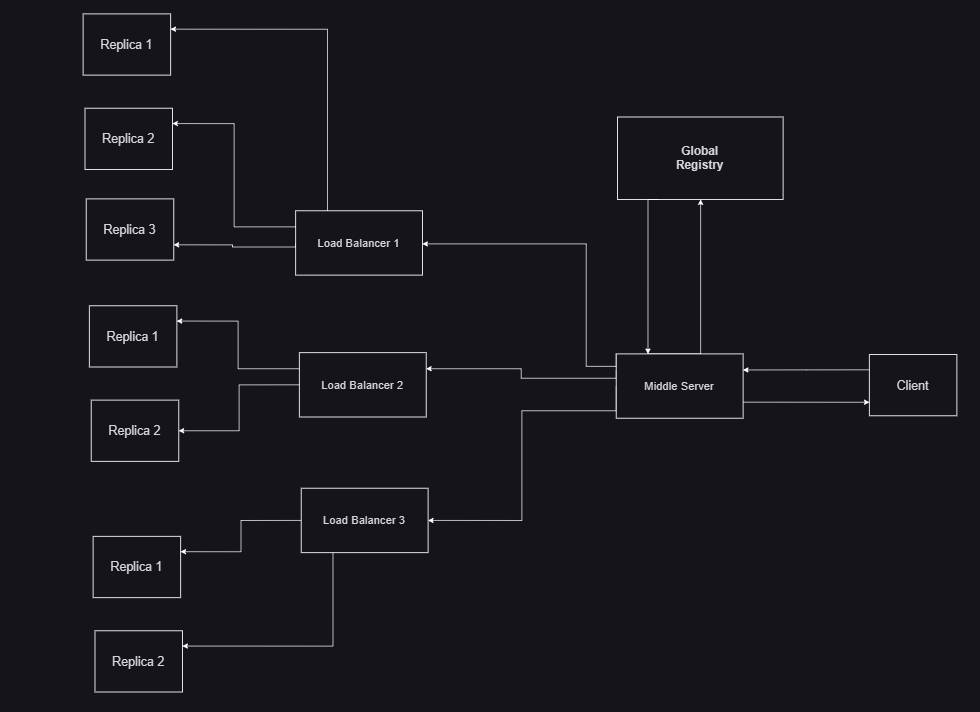

# NDK-RPC-Cluster

[](https://badge.fury.io/js/ndk-rpc-cluster)
[](https://opensource.org/licenses/MIT)
[](https://nodejs.org/)

> **Enterprise-grade RPC cluster system with load balancing, fault tolerance, service discovery and automatic failover support**

## 🚀 Features

- **🔄 Auto Replica Creation** - Automatic Replica Creation if in 10 seconds more than threshold requests are received with respect to number of replicas
- **⚡ Custom Threshold** - Configure request threshold for auto-scaling (default: 2000)
- **🌐 Protocol Support** - Support for both HTTP and HTTPS protocols
- **🔌 Port Configuration** - Flexible port management with `portRequired` option
- **🔄 Load Balancing** - Round-robin distribution across replicas
- **⚡ Fault Tolerance** - Automatic retry mechanisms and failover
- **🔍 Service Discovery** - Global registry for service management
- **📡 RPC Support** - Remote procedure calls with full cluster support
- **🛡️ Error Handling** - Comprehensive error management
- **🔧 Easy Setup** - Simple configuration and deployment

## 📦 Installation

```bash
npm install ndk-rpc-cluster
# or
yarn add ndk-rpc-cluster
# or
pnpm add ndk-rpc-cluster
```

## 🔄 Recent Updates

- Added support for custom protocols (HTTP/HTTPS)
- Added `portRequired` option for flexible URL generation
- Improved error handling and logging
- Enhanced configuration options for better control

## 🏗️ Architecture



## 🚀 Quick Start

### 1. Create Load Balancer with Replicas

`Load Balancer 1`

```javascript
import ndk_load_balancer from "ndk-rpc-cluster/loadBalancer";

let registerFns = [
  {
    function_name: "add",
    function_block: ({ a, b }) => a + b,
  },
];

let config = {
  replicas: 3, // replicas want to create
  port: 3000, // port of load balancer
  register_functions: registerFns, // function to register on replicas
  threashold: 30000 // it means if req reach 30,000 then creates new replica
};

const lb = new ndk_load_balancer(config);
await lb.start(); // start the load balancer server
```

`Load Balancer 2`

```javascript
import ndk_load_balancer from "ndk-rpc-cluster/loadBalancer";

let registerFns = [
  {
    function_name: "sub",
    function_block: ({ a, b }) => a - b,
  },
];

let config = {
  replicas: 3, // replicas want to create
  port: 4000, // port of load balancer
  register_functions: registerFns, // function to register on replicas
  threashold: 50000, // it means if req reach 50,000 then creates new replica
};

const lb = new ndk_load_balancer(config);
await lb.start(); // start the load balancer server
```

### 2. Setup Global Registry

```javascript
import GlobalRegister from "ndk-rpc-cluster/registry";

const global = new GlobalRegister({
  createMiddleware: true, // it must true , it will create middle server
});

let keys = {
  AddService: {
    host: "localhost", // load balancer host
    port: 3000, // load balancer port
    protocol: "http", // http or https
    portRequired: true // include port in service URL (default: true)
  },
  SubService: {
    host: "localhost", // load balancer host
    port: 4000, // load balancer port
    protocol: "http", // http or https
    portRequired: false // service will be accessed without port in URL
  },
};

global.registerKeys(keys);
await global.start(); // start the global registry + middle server
// Registry runs on port 3331, Middleware on port 4132
```

### 3. Create Client

```javascript
import { Client } from "ndk-rpc-cluster/client";

const client = new Client();

const response = await client.request({
  method: "add", // method name to run
  params: {
    // parameters to pass else {}
    a: 2,
    b: 3,
  },
  key: "AddService", // key of service that we declare in Global Registry
});

console.log("Res: ", response);
```

## 🛠️ Configuration

### Load Balancer Options

| Option               | Type   | Default | Description                       |
| -------------------- | ------ | ------- | --------------------------------- |
| `port`               | number | -       | Load balancer server port         |
| `replicas`           | number | -       | Number of replica servers         |
| `basePort`           | number | -       | Starting port for replicas        |
| `protocol`           | string | "http"  | Protocol to use (http/https)      |
| `portRequired`       | boolean| true    | Whether to include port in URLs   |
| `register_functions` | array  | -       | Functions to register on replicas |

### Registry Options

| Option             | Type    | Default | Description                   |
| ------------------ | ------- | ------- | ----------------------------- |
| `createMiddleware` | boolean | `true`  | Auto-create middleware server |

## 🔧 Scripts

```bash
# Start complete cluster
npm run cluster:start

# Start individual components
npm run start:registry
npm run start:load-balancer
npm run start:middleware

# Run tests
npm test
npm run test:client
npm run test:server

# Development mode
npm run dev
```

## 🌐 Default Ports

- **Global Registry**: `3331`
- **Middleware Server**: `4132`
- **Load Balancer**: `3000` (configurable)
- **Replica Servers**: `9000+` (basePort + index)

## 🔄 How It Works

1. **Registry** manages service discovery and routing
2. **Middleware** handles request forwarding
3. **Load Balancer** distributes requests across replicas
4. **Replicas** execute the actual RPC methods
5. **Client** makes requests through the registry

## ⚠️ Important Notes

- Global Registry can only have **one instance** - multiple instances will throw errors
- All components use ES modules (`import/export`)
- Requires Node.js 16+ for optimal performance
- Functions should be pure and stateless for best results

## 🤝 Contributing

1. Fork the repository
2. Create your feature branch (`git checkout -b feature/amazing-feature`)
3. Commit your changes (`git commit -m 'Add some amazing feature'`)
4. Push to the branch (`git push origin feature/amazing-feature`)
5. Open a Pull Request

## 📄 License

This project is licensed under the MIT License - see the [LICENSE](LICENSE) file for details.

## 👨‍💻 Author

**Navnath Kadam**

- GitHub: [@ndk123-web](https://github.com/ndk123-web)
- Email: ndk123.web@gmail.com

## 🙏 Support

If you find this project helpful, please give it a ⭐ on GitHub!

---

**Built with ❤️ for the Node.js community**
